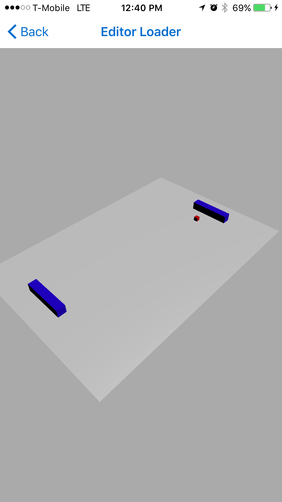
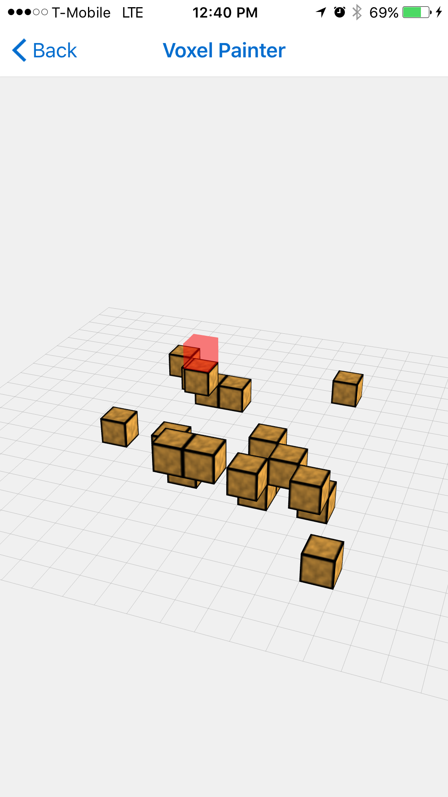
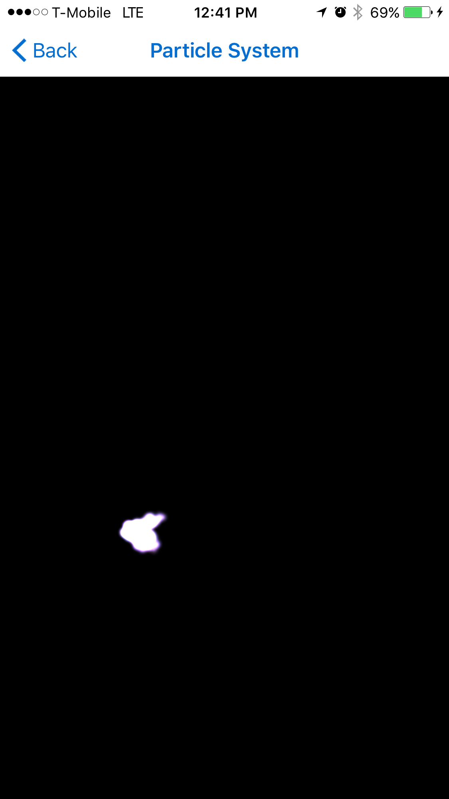

# [expo-three-demo](https://exp.host/@bacon/three-demo)

Collection of Demos for THREE.js in Expo

Try it now: https://exp.host/@bacon/three-demo

## Why? 🤔

I've noticed certain little things don't work or have weird behavior. 
I'm hoping that by implementing the three.js/demos we can find all these things.
Also demos are fun! 🤡

## Stack 🥞

- [React native](https://facebook.github.io/react-native/)
- [Expo](http://expo.io)
- [THREE.js](https://threejs.org/)
- [React Navigation](https://reactnavigation.org/)

## Special Thanks 🙏

- [Mr. Doob, Creator of THREE.js](https://github.com/mrdoob)
- [Nikhilesh Sigatapu, Creator of EXGL](https://github.com/nikki93)
